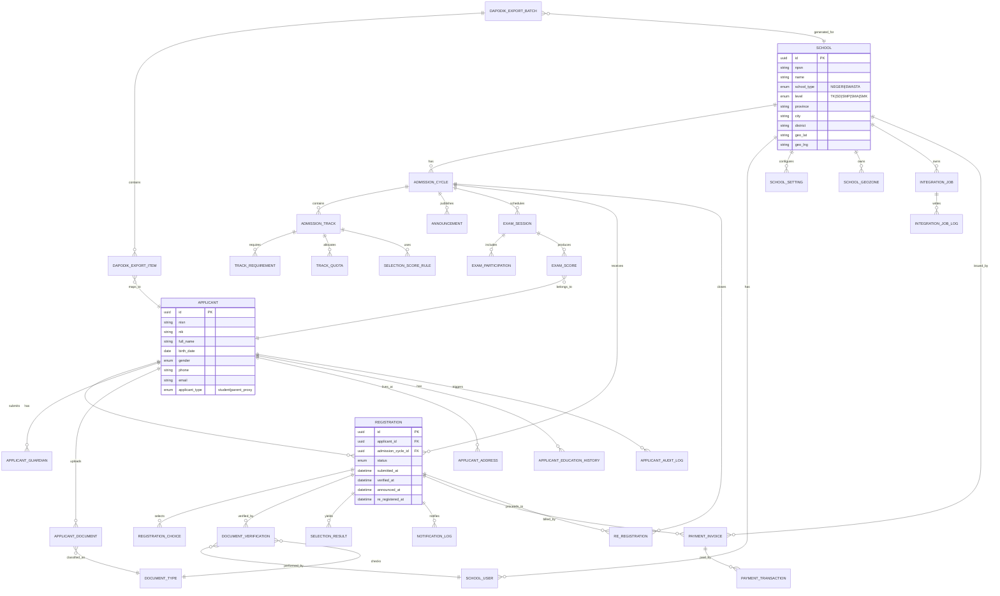
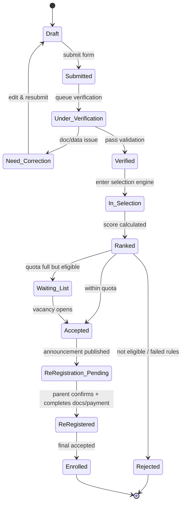
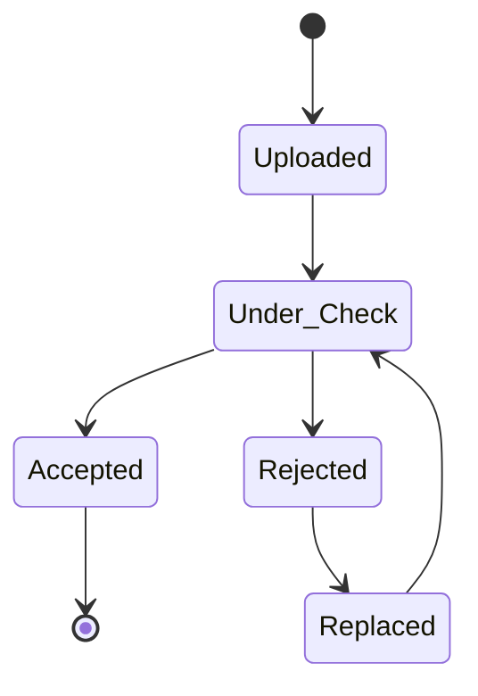
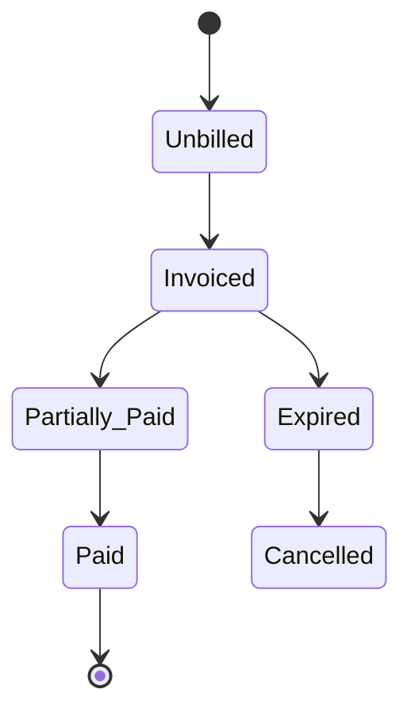
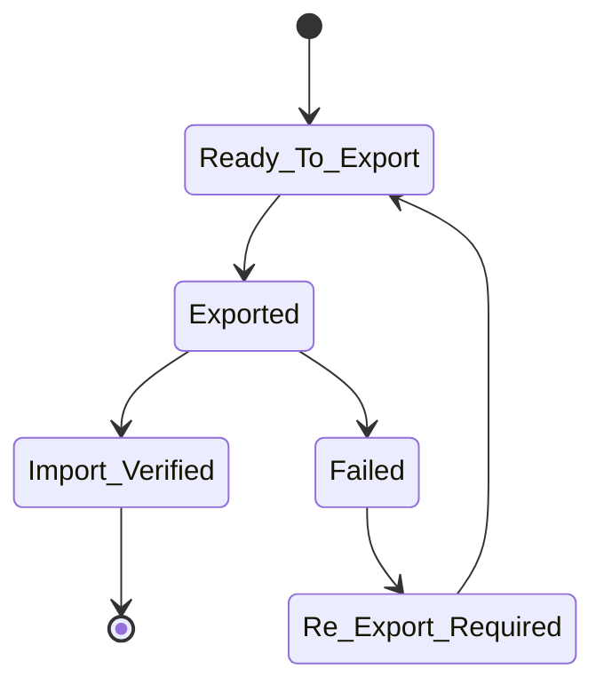

Berikut lanjutan yang lebih operasional, berdasarkan PRD di file lampiran  dan dipetakan ke regulasi yang relevan. Saya susun dalam 4 bagian: **ERD/data model, state machine, regulatory mapping audit-ready, dan split v1/v2**. UU 20/2003 menekankan pemerataan kesempatan dan pengelolaan pendidikan nasional; PP 57/2021 menjadi kerangka SNP dan digunakan pada pendidikan formal/nonformal/informal, sementara PP 57/2021 juga mencabut sebagian ketentuan PP 17/2010. Permendikdasmen 3/2025 mengatur SPMB untuk TK, SD, SMP, SMA, dan SMK, dan Permendikdasmen 1/2026 berlaku untuk standar proses pada PAUD, pendidikan dasar, dan menengah. ([Peraturan BPK][1])

## 1) ERD & Data Model

Dari PRD yang ada, entitas inti sudah terlihat: registrasi, verifikasi dokumen, seleksi multi-jalur, pengumuman, daftar ulang, pembayaran, dan ekspor Dapodik. Itu cocok untuk sistem PPDB/SPMB end-to-end yang menarget sekolah negeri dan swasta, serta alur pasca-terima ke sistem akademik. 

### ERD (ringkas, normalisasi 3NF yang realistis)

### Data model yang disarankan

**Core master tables**

* `schools`
* `school_settings`
* `school_geozones`
* `admission_cycles`
* `admission_tracks`
* `track_quota`
* `track_requirements`
* `document_types`

**Applicant domain**

* `applicants`
* `applicant_guardians`
* `applicant_addresses`
* `applicant_education_history`
* `applicant_documents`

**Transaction/workflow domain**

* `registrations`
* `registration_choices`
* `document_verifications`
* `selection_results`
* `exam_sessions`
* `exam_participations`
* `exam_scores`
* `announcements`
* `re_registrations`
* `payment_invoices`
* `payment_transactions`

**Integration & governance**

* `dapodik_export_batches`
* `dapodik_export_items`
* `integration_jobs`
* `integration_job_logs`
* `audit_logs`
* `notification_logs`

### Field penting yang jangan hilang

Untuk memenuhi kebutuhan PRD dan compliance, minimum field inti yang harus ada:

* Identitas: `nisn`, `nik`, `no_kk`, `nama`, `tanggal_lahir`, `tempat_lahir`, `jenis_kelamin`, `agama`, `kewarganegaraan`
* Domisili: `alamat`, `rt/rw`, `kelurahan`, `kecamatan`, `kabupaten/kota`, `provinsi`, `kode_pos`, `geo_lat`, `geo_lng`
* Sekolah asal: `asal_sekolah`, `npsn_asal`, `jenjang_asal`, `tahun_lulus`
* Jalur PPDB/SPMB: `track_code`, `priority_choice`, `quota_snapshot`
* Dokumen: `document_type`, `file_url`, `file_hash`, `verification_status`, `verified_by`
* Seleksi: `score_total`, `score_components`, `rank`, `tie_breaker_rule`
* Daftar ulang: `re_registration_status`, `deadline_at`, `final_acceptance_status`
* Dapodik export: `export_batch_id`, `mapping_version`, `sync_status`

## 2) State Machine Diagram

PRD sudah mengarah ke alur end-to-end: registrasi, verifikasi, seleksi, pengumuman, daftar ulang, lalu export ke Dapodik. Itu sudah bagus, tetapi perlu diformalisasi menjadi state machine supaya backend, UI, dan audit trail tidak saling bertabrakan. 

### Primary state machine untuk `Registration`

### Perlu 3 state machine tambahan

Supaya sistem rapi, saya sarankan ada state machine terpisah untuk:

1. **Document lifecycle**

2. **Payment lifecycle** untuk sekolah swasta

3. **Dapodik sync lifecycle**

### Kenapa ini penting

Karena PRD kamu menampung dua mode berbeda—negeri dan swasta—maka status PPDB, pembayaran, dan sinkronisasi Dapodik tidak boleh digabung dalam satu state yang terlalu sederhana. Ini juga penting agar aturan kuota, jalur, dan hasil seleksi bisa diaudit. 

## 3) Regulatory Mapping yang siap audit

Berikut pemetaan yang lebih audit-friendly. Untuk konteks regulasi, PP 57/2021 merupakan kerangka SNP yang berlaku untuk pendidikan formal, nonformal, dan informal, dan Permendikdasmen 3/2025 mengatur SPMB untuk TK sampai SMA/SMK; Permendikdasmen 1/2026 menetapkan standar proses pada PAUD, pendidikan dasar, dan menengah. PP 57/2021 juga tercatat mencabut sebagian ketentuan PP 17/2010. ([Peraturan BPK][2])

| Regulasi                             | Implikasi ke sistem                                                                        | Requirement yang harus ada                                                                   | Evidence/audit log                               |
| ------------------------------------ | ------------------------------------------------------------------------------------------ | -------------------------------------------------------------------------------------------- | ------------------------------------------------ |
| UU 20/2003 Sisdiknas                 | Sistem harus mendukung pemerataan akses, transparansi, dan tata kelola pendidikan nasional | Form registrasi yang adil, akses publik yang transparan, data penerimaan yang terdokumentasi | log pendaftaran, log pengumuman, histori kuota   |
| PP 57/2021 jo. PP 4/2022             | Standar Nasional Pendidikan menjadi acuan penyelenggaraan dan evaluasi pendidikan          | Konfigurasi jenjang, jalur, kuota, evaluasi hasil seleksi, dan dokumentasi proses            | konfigurasi cycle, selection rule, export report |
| PP 17/2010                           | Masih relevan untuk tata kelola yang tidak dicabut/diubah                                  | Persetujuan otoritas sekolah, otorisasi admin, pengelolaan data peserta didik                | audit trail approval, role-based access          |
| Permendikbud 79/2015 tentang Dapodik | Data pokok pendidikan harus bisa dipetakan ke format Dapodik                               | export mapping configurable, validation field, readiness status per siswa                    | export batch, mapping version, import result     |
| Permendikdasmen 3/2025               | SPMB mencakup TK, SD, SMP, SMA, SMK                                                        | engine jalur per jenjang, kuota per jalur, aturan tiebreaker, public announcement flow       | rule version, quota snapshot, ranking snapshot   |
| Permendikdasmen 1/2026               | Standar proses berlaku dari PAUD sampai menengah                                           | workflow proses yang berbeda per jenjang, terutama TK/SD yang tidak identik dengan SMP/SMA   | per-level config, admission policy log           |

### Catatan audit yang perlu ditulis di PRD/TRD

1. **Buat regulatory matrix per jenjang**, bukan satu aturan untuk semua. Ini penting karena TK/PAUD tidak cocok disamakan dengan SMP/SMA. Permendikdasmen 1/2026 mencakup PAUD, pendidikan dasar, dan menengah, jadi engine harus parameterized by level. ([Peraturan BPK][3])
2. **Tandai PP 57/2021 sebagai “as amended by PP 4/2022”** karena PP 4/2022 mengubah PP 57/2021. ([Peraturan BPK][2])
3. **Jangan hardcode Dapodik field mapping**; PRD kamu sudah benar mengarah ke configurable mapping, dan itu perlu dijaga karena format import Dapodik bersifat file-based/desktop-dependent di praktiknya. PRD kamu sudah mengantisipasi itu di bagian export. 
4. **Pisahkan public transparency dari privasi**. Untuk hasil yang diumumkan ke publik, tampilkan hanya data minimum seperti nama dan nomor pendaftaran; jangan tampilkan NIK/KK penuh. Ini selaras dengan desain privasi yang sudah kamu mulai di NFR. 

## 4) Split v1 (MVP realistis) vs v2 (advanced)

PRD saat ini sudah kuat, tetapi kalau targetnya go-live realistis, scope v1 perlu dipisah lebih tegas dari v2. Saat ini PRD masih mencampur kebutuhan sekolah swasta, negeri, publik ranking, TKA, Dapodik, pembayaran, dan integrasi eksternal dalam satu paket besar. 

### v1 — MVP realistis

Fokus: **bisa dipakai sekolah nyata tanpa terlalu banyak integrasi berat**

**Wajib ada**

* Setup PPDB per sekolah
* Jenjang: TK / SD / SMP / SMA / SMK, tapi dengan rule sederhana per jenjang
* Registrasi akun pendaftar
* Form data siswa + orang tua/wali + sekolah asal
* Upload dokumen wajib
* Verifikasi manual oleh operator
* Jalur dasar:

  * Negeri: domisili, afirmasi, prestasi, mutasi
  * Swasta: reguler, tes masuk, beasiswa
* Ranking/seleksi berbasis rule engine sederhana
* Pengumuman hasil
* Daftar ulang
* Payment untuk swasta
* Export data ke format Dapodik configurable
* Audit trail dasar
* Notifikasi email/WhatsApp basic

**Batasan v1**

* Tidak perlu API Dukcapil real-time
* Tidak perlu CBT internal
* Tidak perlu integrasi TKA otomatis
* Tidak perlu dashboard dinas
* Tidak perlu analytics advanced
* Tidak perlu geo-fencing canggih

### v2 — Advanced features

Fokus: **kompliansi, otomatisasi, dan diferensiasi produk**

* Integrasi Dukcapil validasi NIK real-time
* Integrasi TKA nasional otomatis
* Public ranking realtime
* Peta zonasi interaktif
* Fraud detection:

  * duplicate account
  * alamat palsu
  * anomali GPS
  * device fingerprint
* CBT internal
* White-label untuk dinas/B2G
* Multi-school orchestration untuk yayasan
* Advanced reporting & dashboard
* Approval workflow berlapis
* Workflow SLA & escalation
* Multi-branch payment reconciliation
* Template Dapodik mapping versioned per tahun ajaran

## 5) Apakah PRD ini sudah menutup kebutuhan “TK, SD, SMP, SMA/SMK negeri dan swasta”?

Jawaban singkatnya: **belum sepenuhnya**, tetapi fondasinya sudah ada. PRD kamu sangat kuat untuk **SMP/SMA negeri dan swasta**, terutama karena sudah punya jalur seleksi, verifikasi, pengumuman, pembayaran swasta, dan export Dapodik. Namun untuk **TK/PAUD dan SD**, mekanisme penerimaan biasanya harus lebih parameterized: tidak boleh mengasumsikan skema yang sama dengan SMP/SMA, khususnya untuk syarat akademik, ranking, dan kelengkapan dokumen. Karena Permendikdasmen 3/2025 memang mencakup TK–SMA/SMK, dan Permendikdasmen 1/2026 berlaku pada PAUD sampai menengah, maka engine-nya harus per-jenjang, bukan satu flow tunggal. ([Peraturan BPK][4])

Kalau kamu ingin, langkah berikutnya yang paling berguna adalah saya ubah ini menjadi **TRD ringkas** atau langsung **schema SQL + state table + field mapping Dapodik** agar bisa dipakai engineering.

[1]: https://peraturan.bpk.go.id/details/43920/uu-no-20-tahun-2003?utm_source=chatgpt.com "Undang-undang (UU) No. 20 Tahun 2003"
[2]: https://peraturan.bpk.go.id/Details/165024/pp-no-57-tahun-2021?utm_source=chatgpt.com "PP No. 57 Tahun 2021"
[3]: https://peraturan.bpk.go.id/Details/224238/permendikbudriset-no-16-tahun-2022?utm_source=chatgpt.com "Permendikbudriset No. 16 Tahun 2022"
[4]: https://peraturan.bpk.go.id/Details/315671/permendikdasmen-no-3-tahun-2025?utm_source=chatgpt.com "Permendikdasmen No. 3 Tahun 2025"
